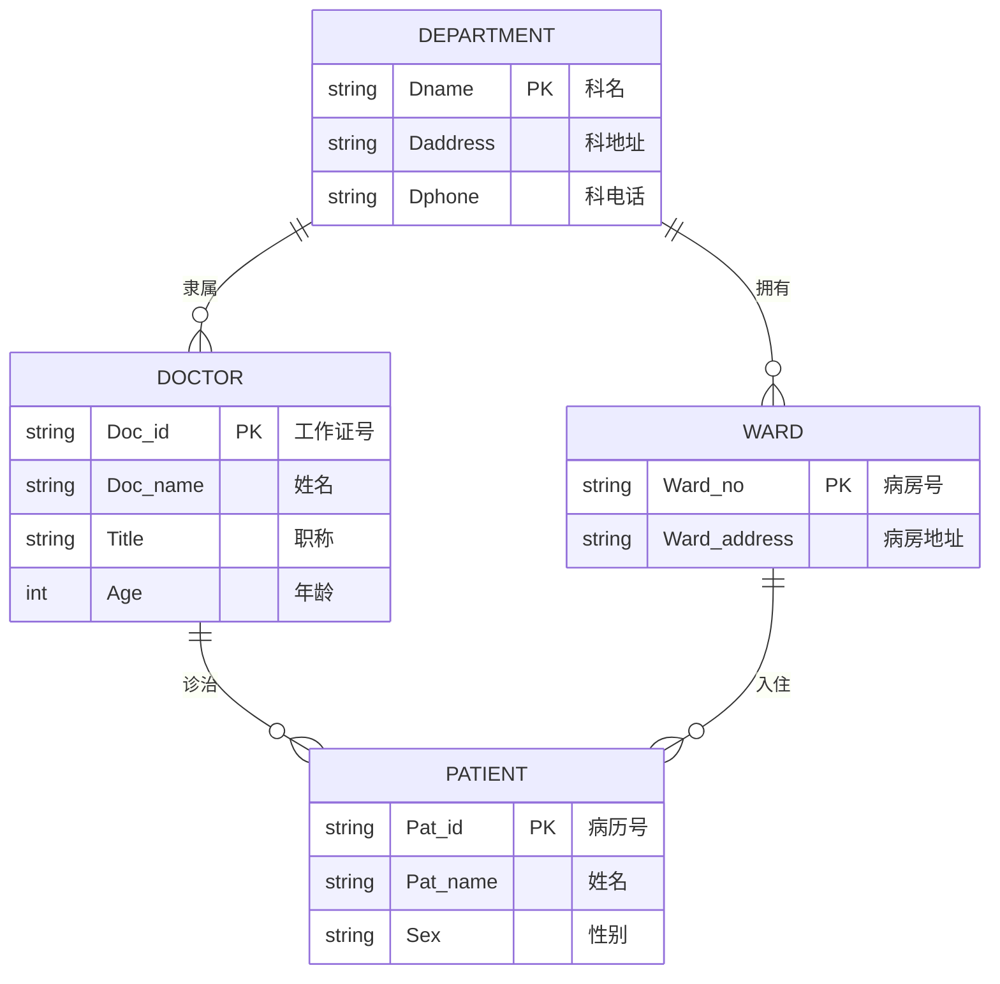

# 《数据库原理及应用》期末考试试卷（A卷）解析版

**时间：100分钟**
**年级专业班级：物联网工程、网络工程**
**考试形式：闭卷**

---

### 一、 单项选择题（每题2分，共40分）

**1. 具有数据冗余度小，数据共享以及较高数据独立性等特征的系统是（B）。**

*   **A. 文件系统**
*   **B. 数据库系统**
*   **C. 管理系统**
*   **D. 高级程序**
*   **📝 解析**：**数据库系统（DBMS）** 通过统一的数据管理和数据模型，有效地减少了数据冗余，实现了多用户、多应用的数据共享，并通过三级模式结构（外模式、模式、内模式）提供了较高的物理和逻辑数据独立性。文件系统通常冗余较大、共享性差；管理系统和高级程序不是专门描述数据管理特征的系统。

**2. 在一个关系中，如果有这样一个属性组存在，它的值能唯一的标识此关系中的一个元组，该属性组称为（A）。**

*   **A. 候选码**
*   **B. 数据项**
*   **C. 主属性**
*   **D. 主属性值**
*   **📝 解析**：在关系数据库中，能唯一标识一个元组（行）的最小属性组称为**候选码**。一个表可能有多个候选码，选定其中一个作为**主码**。“主属性”是包含在任一候选码中的属性，而“数据项”和“主属性值”并非此概念的标准术语。

**3. 在数据库设计中，将E-R图转换成关系数据模型的过程属于（B）。**

*   **A. 需求分析阶段**
*   **B. 逻辑设计阶段**
*   **C. 概念设计阶段**
*   **D. 物理设计阶段**
*   **📝 解析**：数据库设计的主要阶段包括：需求分析 → 概念设计（E-R图）→ **逻辑设计**（将概念模型/E-R图转换为具体DBMS支持的关系模型）→ 物理设计（存储结构、索引等）。

**4. 设F是基本关系R的一个或一组属性，但不是关系R的码。如果F与基本关系S的主码K相对应，则称F是基本关系R的（D）。**

*   **A. 候选码**
*   **B. 主码**
*   **C. 全码**
*   **D. 外码**
*   **📝 解析**：此描述是**外码（Foreign Key）** 的标准定义。外码是关系R中的一个属性（组），它不是R的主码，但对应于另一个关系S的主码K，用于建立两个关系之间的参照（引用）完整性联系。

**5. 当局部 E-R 图合并成全局 E-R 图时，可能出现冲突，下面所列举的冲突中（B）不属于上述冲突。**

*   **A. 属性冲突**
*   **B. 语法冲突**
*   **C. 结构冲突**
*   **D. 命名冲突**
*   **📝 解析**：合并局部E-R图时，主要可能发生**属性冲突**（类型、取值范围）、**命名冲突**（同名异义、异名同义）和**结构冲突**（同一实体在不同图中的属性组成或联系类型不同）。**语法冲突**不是此过程中的标准冲突类型。

**6. 在 SQL 语言中，视图是数据库体系结构中的（C）。**
*   **A. 内模式**
*   **B. 模式**
*   **C. 外模式**
*   **D. 物理模式**
*   **📝 解析**：数据库三级模式结构包括**内模式**（存储）、**模式**（逻辑）和**外模式**（用户视图）。**视图（View）** 是从一个或多个基本表导出的虚表，为用户提供了定制的数据视角，属于**外模式**范畴。

**7. 下列（C）运算不是专门的关系运算。**

*   **A. 选择**
*   **B. 投影**
*   **C. 笛卡尔积**
*   **D. 连接**
*   **📝 解析**：专门的关系运算指为关系模型特殊设计的运算，包括**选择、投影、连接、除**。**笛卡尔积**是传统的集合运算（并、交、差、笛卡尔积）之一，源于数学集合论，并非关系模型特有。

**8. 日志文件的主要作用是处理数据库的（C）。**
*   **A. 安全性**
*   **B. 完整性**
*   **C. 恢复**
*   **D. 并发控制**
*   **📝 解析**：**日志文件**记录所有事务对数据的更新操作。当系统发生故障时，可利用日志进行**恢复**，使数据库恢复到某个一致状态。安全性、完整性和并发控制主要通过其他机制（如权限、约束、封锁）实现。

**9. 对 DB 中数据的操作分成两大类：（A）**
*   **A. 查询和更新**
*   **B. 检索和修改**
*   **C. 查询和修改**
*   **D. 插入和修改**
*   **📝 解析**：对数据的基本操作可概括为**查询**（读取，不改变数据）和**更新**（改变数据，包括插入、删除、修改）。其他选项不够全面或准确。

**10. 规范化理论是关系数据库进行逻辑设计的理论依据。根据这个理论，关系数据库中的关系必须满足：其每一属性都是（B）**
*   **A. 互不相关的**
*   **B. 不可分解的**
*   **C. 长度可变的**
*   **D. 互相关联的**
*   **📝 解析**：这是第一范式（1NF）的要求，即关系的每个属性必须是**原子的、不可再分**的数据项（不能是集合、数组等），这是关系模型的基础。

**11. 假定学生关系是 S（S＃，SNAME，SEX，AGE），课程关系是 C（C＃，CNAME，TEACHER），学生选课关系是 SC（S＃，C＃，GRADE）。要查找选修“COMPUTER”课程的“女”学生姓名，将涉及到关系（D）**
*   **A. S**
*   **B. SC. C**
*   **C. S. SC**
*   **D. S. C. SC**
*   **📝 解析**：此查询需结合三个表：`C`(找`COMPUTER`课的`C#`)；`S`(找`SEX='女'`的学生)；`SC`(连接学生与选课)。因此需要`S`、`C`和`SC`三个关系。

**12. 用下面的 SQL 语句建立一个基本表：可以插入到表中的元组是（A）**

```sql
CREATE TABLE Student
(Sno CHAR(4) PRIMARY KEY,
Sname CHAR(8) NOT NULL,
Sex CHAR(2),
Age INT)
```
*   **A. '5021', '刘祥', NULL, NULL**
*   **B. NULL, '刘祥', NULL, 21**
*   **C. '5021', NULL, 男, 21**
*   **D. '5021', '刘祥', 男, 21**
*   **📝 解析**：`Sno`是主键（非空唯一），`Sname`非空，`Sex`和`Age`可为空。B违反主键非空；C违反`Sname`非空；D中`‘男’`应使用单引号`'男'`（字符串常量），否则可能引发语法错误。只有A完全满足约束。

**13. 事务的执行次序称为（B）**

*   **A. 过程**
*   **B. 调度**
*   **C. 步骤**
*   **D. 优先级**
*   **📝 解析**：在并发控制中，多个事务按一定顺序执行，这个顺序称为**调度**。它决定了事务指令如何交错执行，是保证并发正确性的关键。

**14. 下列四项中，不属于数据库系统的特点的是（C）**
*   **A. 数据结构化**
*   **B. 数据由 DBMS 统一管理和控制**
*   **C. 数据冗余度大**
*   **D. 数据独立性高**
*   **📝 解析**：**数据冗余度大**是文件系统等传统方式的缺点。数据库系统的主要目标之一正是通过数据共享和规范化来**减少冗余**。

**15. 概念模型是现实世界的第一层抽象，这一类模型中最著名的模型是（D）**
*   **A. 层次模型**
*   **B. 关系模型**
*   **C. 网状模型**
*   **D. 实体-联系模型**
*   **📝 解析**：概念模型（信息模型）用于描述现实世界概念结构，最著名的是**实体-联系模型（E-R模型）**。层次、关系和网状模型是具体的**逻辑/数据模型**。

**16. 数据的物理独立性是指（C）**
*   **A. 数据库与数据库管理系统相互独立**
*   **B. 用户程序与数据库管理系统相互独立**
*   **C. 用户的应用程序与存储在磁盘上数据库中的数据是相互独立的**
*   **D. 应用程序与数据库中数据的逻辑结构是相互独立的**
*   **📝 解析**：**物理独立性**指当数据库的**内模式**（物理存储结构）改变时，只要**模式**（逻辑结构）不变，**应用程序**就不需要修改。这正是三级模式结构带来的好处。

**17. 有一名为“列车运营”实体，含有：车次、日期、实际发车间间、实际抵达时间、情况摘要等属性，该实体的码是（C）**
*   **A. 车次**
*   **B. 日期**
*   **C. 车次+日期**
*   **D. 车次+情况摘要**
*   **📝 解析**：同一车次在不同日期会多次运营。单独“车次”或“日期”都不能唯一标识一次具体运营。必须组合 **（车次，日期）** 才能作为主码。

**18. 学校数据库中有学生和宿舍两个关系：假设有的学生不住宿，床位也可能空闲。如果要列出所有学生住宿和宿舍分配的情况，包括没有住宿的学生和空闲的床位，则应执行（A）**
*   **A. 全外联接**
*   **B. 左外联接**
*   **C. 右外联接**
*   **D. 自然联接**
*   **📝 解析**：要求包含**两边所有元组**（未住宿学生 + 空闲床位）。**全外连接**会保留连接两侧所有未匹配的元组，并用NULL填充，完全符合题意。

**19. 把对关系 SPJ 的属性 QTY 的修改权授予用户李勇的 SQL 语句是（C）**
*   **A. GRANT QTY ON SPJ TO '李勇'**
*   **B. GRANT UPDATE(QTY) ON SPJ TO '李勇'**
*   **C. GRANT UPDATE (QTY) ON SPJ TO 李勇**
*   **D. GRANT UPDATE ON SPJ (QTY) TO 李勇**
*   **📝 解析**：标准SQL授权语法：`GRANT <权限> ON <对象> TO <用户>`。授予对特定列的更新权限，应用 `UPDATE(列名)` 形式。用户名`李勇`不应加引号（除非是带引号的标识符）。C选项语法正确（空格不影响）。

**20. 关系规范化中的插入操作异常是指（D）**
*   **A. 不该删除的数据被删除**
*   **B. 不该插入的数据被插入**
*   **C. 应该删除的数据未被删除**
*   **D. 应该插入的数据未被插入**
*   **📝 解析**：**插入异常**指由于不良设计（如部分函数依赖），导致**一个完整的实体信息无法被插入**。例如，想记录一个新系的信息，但因暂无学生（主键部分为空）而无法插入。

---

### 二、填空题（每空 1 分，共 10 分）

**1、数据模型的三要素包括（数据结构）、（数据操作）、（数据的完整性约束）。**

**2、关系的完整性分为（实体完整性）、（参照完整性）、（用户定义的完整性）三类。**

**3、并发控制的三大问题为（丢失修改）、（不可重复读）、（读“脏”数据）。**
*（或：丢失更新、脏读、不可重复读）*

**4、关系的第 2 范式是在第 1 范式的基础上去掉非主属性对码的（部分函数依赖）。**

---

### 三、名词解释及简答题（共 5 题，共 20 分）

**1. 请详细说明数据库管理系统 DBMS 的功能。（8 分）**
> **答**：数据库管理系统（DBMS）是位于用户与操作系统之间的数据管理软件，主要功能包括：
> 1.  **数据定义功能**：提供数据定义语言（DDL），用于定义数据库中的各类对象（模式、表、视图、索引等）。
> 2.  **数据组织、存储和管理**：高效组织、存储数据，并实现数据间的联系。
> 3.  **数据操纵功能**：提供数据操纵语言（DML），支持数据的查询、插入、删除和修改。
> 4.  **数据库的事务管理和运行管理**：保证数据的安全性、完整性、多用户并发控制，以及系统故障后的恢复。
> 5.  **数据库的建立和维护功能**：包括数据库初始装入、转储、恢复、重组、性能监视和分析等。
> 6.  **其他功能**：如通信、数据转换与互操作等。

**2. 请给出一级封锁协议的内容。（2 分）**
> **答**：一级封锁协议规定：**事务在修改数据之前必须先对其加排他锁（X锁），并直到事务结束（提交或回滚）后才释放**。该协议可以防止“丢失修改”问题。

**3. 请简述事务的四个特性。（4 分）**
> **答**：事务具有四个基本特性（ACID特性）：
> *   **原子性**：事务是一个不可分割的工作单位，事务中的操作要么都发生，要么都不发生。
> *   **一致性**：事务执行必须使数据库从一个一致性状态转变到另一个一致性状态。
> *   **隔离性**：一个事务的执行不能被其他事务干扰。
> *   **持久性**：一个事务一旦提交，它对数据库中数据的改变就是永久性的。

**4. 数据库设计分为哪几个阶段？（6 分）**
> **答**：数据库设计主要分为以下六个阶段：
> 1.  **需求分析阶段**：准确了解与分析用户需求。
> 2.  **概念结构设计阶段**：形成独立于DBMS的概念模型（常用E-R图）。
> 3.  **逻辑结构设计阶段**：将概念模型转换为某个具体DBMS所支持的数据模型（如关系模型），并进行优化。
> 4.  **物理结构设计阶段**：为逻辑数据模型选取最适合应用环境的物理结构。
> 5.  **数据库实施阶段**：建立数据库，编写与调试应用程序，组织数据入库，进行试运行。
> 6.  **数据库运行和维护阶段**：投入正式运行，并进行持续的评价、调整与修改。

---

### 四、关系代数与 SQL 操作题（每小题 3 分，共 15 分）

**已知关系模式：**
*   学生：`student (sno, sname, ssex, sage, sdept)`
*   课程：`course (cno, cname, cpno, ccredit)`
*   选修：`sc (sno, cno, grade)`

**1. 试用关系代数表达式表示：查询学生表中的姓名及性别？**
> **答**：`π sname, ssex (student)`
>
> **解析**：`π` (pi) 表示投影操作，用于选择指定的列。

**2. 试用 SQL 查询语句表示：查询和‘刘佳’年龄相同的学生的姓名？**
> **答**：
> ```sql
> -- 方法1：自连接
> SELECT s2.sname
> FROM student s1, student s2
> WHERE s1.sname = ‘刘佳’ AND s1.sage = s2.sage AND s2.sname != ‘刘佳’;
> 
> -- 方法2：子查询
> SELECT sname
> FROM student
> WHERE sage = (SELECT sage FROM student WHERE sname = ‘刘佳’)
> AND sname != ‘刘佳’;
> ```
>
> **解析**：核心是找到年龄等于刘佳年龄的学生，并排除刘佳本人。

**3. 试用 SQL 查询语句表示：查询选修了课程名为‘数据库’的同学的基本信息及选课情况，不包含课程名？**
> **答**：
> ```sql
> SELECT stu.*, sc.cno, sc.grade
> FROM student stu, sc, course c
> WHERE stu.sno = sc.sno
> AND sc.cno = c.cno
> AND c.cname = ‘数据库’;
> -- 或使用显式JOIN语法
> SELECT stu.*, sc.cno, sc.grade
> FROM student stu
> JOIN sc ON stu.sno = sc.sno
> JOIN course c ON sc.cno = c.cno
> WHERE c.cname = ‘数据库’;
> ```
>
> **解析**：这是一个典型的三表连接查询。`student`与`sc`通过`sno`连接，`sc`与`course`通过`cno`连接，并用`cname`作为过滤条件。

**4. 试用 SQL 语句：修改学生表增加一列电话号码 stel 数据类型为字符类型长度为 11。**
> **答**：
> ```sql
> ALTER TABLE student ADD stel CHAR(11);
> ```
>
> **解析**：使用 `ALTER TABLE ... ADD` 语句为已存在的表添加新列。

**5. 试用 SQL 语句：对 SC 表插入一条数据（‘01’，‘C1’，80）。**
> **答**：
> ```sql
> INSERT INTO sc (sno, cno, grade) VALUES (‘01’, ‘C1’, 80);
> ```
>
> **解析**：使用 `INSERT INTO ... VALUES` 语句向表中插入新记录。指定列名是更清晰、安全的方式。

---

### 五、设计题（15 分）

某医院病房管理系统中，包括四个实体型，分别为：
科室：科名，科地址，科电话
病房：病房号，病房地址
医生：工作证号，姓名，职称，年龄
病人：病历号，姓名，性别
且存在如下语义约束：

① 一个科室有多个病房、多个医生，一个病房只能属于一个科室，一个医生只属于一个科室；
② 一个医生可负责多个病人的诊治，一个病人的主管医生只有一个；③ 一个病房可入住多个病人，一个病人只能入住在一个病房。

注意：不同科室可能有相同的病房号。
完成如下设计：

**（1）画出该医院病房管理系统的 E-R 图；（5 分）**



**📝 E-R 图说明**：
*   **实体**：定义了 `DEPARTMENT`（科室）、`WARD`（病房）、`DOCTOR`（医生）、`PATIENT`（病人）四个实体，并列出其属性。
*   **联系**：定义了四个联系，均为 `1:n` 类型。
    *   `DEPARTMENT` 与 `WARD` 通过“拥有”联系。
    *   `DEPARTMENT` 与 `DOCTOR` 通过“隶属”联系。
    *   `DOCTOR` 与 `PATIENT` 通过“诊治”联系。
    *   `WARD` 与 `PATIENT` 通过“入住”联系。
*   **主键**：在图中用 `PK` 标出，分别为 `Dname`, `Ward_no`, `Doc_id`, `Pat_id`。注意：在实际数据库设计中，`WARD` 实体的主键应结合科室信息，这在转换关系模型时体现。

**（2）将该 E-R 图转换为关系模型；（5 分）**
**（3）指出转换结果中每个关系模式的主码和外码。（5 分）**

遵循“1:1和1:n的联系进行合并”至n端的原则，转换后的关系模型、主码及外码如下表所示：

| 关系名         | 属性                                              | 说明与主码                                                   | 外码                                                         |
| :------------- | :------------------------------------------------ | :----------------------------------------------------------- | :----------------------------------------------------------- |
| **Department** | `(Dname, Daddress, Dphone)`                       | **科室表**。主码为 `Dname`。                                 | 无                                                           |
| **Ward**       | `(Dname, Ward_no, Ward_address)`                  | **病房表**。由于“不同科室可能有相同病房号”，且病房属于科室（1:n），故将科室主码 `Dname` 加入，**主码为 `(Dname, Ward_no)`**。 | `Dname` 参照 `Department(Dname)`                             |
| **Doctor**     | `(Doc_id, Doc_name, Title, Age, Dname)`           | **医生表**。主码为 `Doc_id`。因医生隶属科室（1:n），故加入科室主码 `Dname` 作为外码。 | `Dname` 参照 `Department(Dname)`                             |
| **Patient**    | `(Pat_id, Pat_name, Sex, Doc_id, Dname, Ward_no)` | **病人表**。主码为 `Pat_id`。因病人由医生诊治（1:n）且入住病房（1:n），故加入医生主码 `Doc_id` 和病房的主码 `(Dname, Ward_no)` 作为外码。 | 1. `Doc_id` 参照 `Doctor(Doc_id)` <br> 2. `(Dname, Ward_no)` 参照 `Ward(Dname, Ward_no)` |

**📝 转换说明**：
*   **Department**：实体独立成表。
*   **Ward**：病房与科室为 **n:1** 联系，将“1”端（科室）的主码 `Dname` 并入“n”端（病房）作为**外码**。同时，由于题目注明“不同科室可能有相同的病房号”，因此病房表的主码必须是 **`(Dname, Ward_no)`**，而不能仅仅是 `Ward_no`。
*   **Doctor**：医生与科室为 **n:1** 联系，将科室主码 `Dname` 并入医生表作为外码。
*   **Patient**：病人同时与医生（n:1）和病房（n:1）存在联系，因此需要将两者的主码（`Doc_id` 和 `(Dname, Ward_no)`）都并入病人表作为外码。
