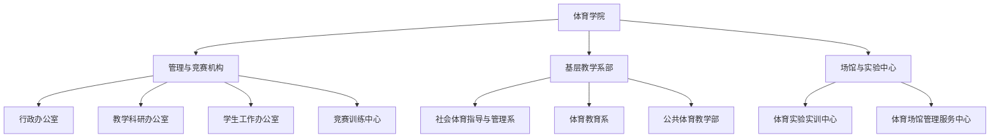

# 体育学院 机构设置与专任师资队伍

- **机构名称**：湖南城市学院体育学院
- **版本号**：v1.0 (生效中)
- **更新日期**：2026-09-12
- **官方网址**：http://tyxy.hncu.edu.cn/szdw/zzjs.htm
- **专业设置**：社会体育指导与管理（省级一流本科专业）、体育教育、休闲体育

---

## 🏢 教学系室与管理保障机构

---

## 👨‍🏫 资深教授与骨干教师名录

全院拥有一批高水平运动训练专家、国家级裁判员与体育科研骨干：
- **胡科** 教授 / 博士（院长、学科带头人）
- **燕成** 教授（资深体育教育与运动训练专家）
- **李志宏** 教授（资深体育学科带头人）
- **欧岳山** 教授（副院长、公共体育教学主管）
- **刘鸥** 教授
- **许进** 副教授（副院长、运动竞赛主管）
- **匡艳群** 副教授（党委副书记）
- 另有一支承担全校一万余名本科生体质健康测试、大学体育公共课教学及各项省级以上体育竞赛代表队的专任教练员教师团队。
