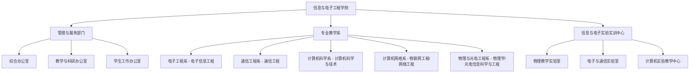

# 信息与电子工程学院 机构设置与专任师资队伍

- **机构名称**：湖南城市学院信息与电子工程学院
- **版本号**：v1.0 (生效中)
- **更新日期**：2026-09-12
- **官方网址**：http://xdy.hncu.edu.cn/
- **办公地点**：湖南省益阳市迎宾东路518号电信楼

---

## 🏢 学院内设组织架构体系

---

## 👨‍🏫 教授、博士风采与专家领军团队

学院拥有一支高素质、结构合理的教学科研队伍，涵盖电子信息、计算机科学、通信与光电工程领域：

### 1. 领军学者与教授专家
- **黄建龙** 教授（“芙蓉学者”讲座教授）
- **蒋冬初** 教授 / 博士（院长、湖南省青年骨干教师）
- **张光富** 教授 / 博士（资深学科带头人）
- **谭伟石** 教授 / 博士（电子信息与光电领域资深学者）
- **邓杨保** 教授 / 博士（副院长、通信与信号处理方向专家）

### 2. 五大系室专任师资分布
- **电子工程系**：承担电子信息工程专业本科教学，研究方向涵盖嵌入式系统、物联网传感与信号处理。
- **通信工程系**：承担通信工程专业本科教学，涵盖5G通信、无线网络及现代信息传输技术。
- **计算机科学系**：承担计算机科学与技术专业本科教学，主攻软件工程、大数据、人工智能与智能计算。
- **计算机网络系**：承担网络工程、物联网工程教学，主攻网络安全、分布式系统与云原生架构。
- **物理与光电工程系**：承担应用物理学、光电信息专业及全校大学物理公共课实验教学。

---

## 🔬 实验教学与工程实训平台

- **信息与电子实验实训中心**：下设微机接口、通信原理、高频电路、EDA技术、光电信息、普通物理等20余个专业实验室，承担全校工科基础实验及学院专业实训课程。
