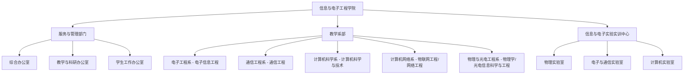

# 信息与电子工程学院 机构设置与系室职责

- **机构名称**：湖南城市学院信息与电子工程学院
- **版本号**：v1.0 (生效中)
- **更新日期**：2026-09-12
- **官方网址**：http://xdy.hncu.edu.cn/xygk/nsjg.htm
- **办公地点**：湖南省益阳市迎宾东路518号电信楼

---

## 🏢 学院内设组织架构体系

---

## 📌 服务与管理部门工作职责

### 1. 综合办公室工作职责
1. 具体负责学院日常事务性工作和学院各部门的协调工作；
2. 协助院领导做好会议的组织、通知、考勤、会议记录、信息上报等工作；
3. 负责学院文件、报刊、杂志的收发、整理、传阅、归档、上报等工作；
4. 负责学院教职工的考勤与绩效工资核算、上报工作；
5. 学院行政公章的管理工作；
6. 学院日常业务费的预支与报帐工作；
7. 学院行政办公设备、物资耗材、办公用品的申报与采购工作；
8. 学校相关职能部门的联系和对外接待工作；
9. 负责学院后勤、安全、保障工作，落实公共环境卫生与消防安全防盗检查；
10. 阳光服务平台的管理、档案收集与管理、高层次人才引进服务等。

### 2. 教学与科研办公室工作职责
1. 负责全院所有专业课任课老师、兼课老师以及外聘老师的教学课程安排；
2. 负责考务管理，包括期末排考、监考安排、阅卷监控及试卷装订验收；
3. 负责教学日历、辅导答疑、教学工作量等教学资料收集审核；
4. 负责教改课题、科研项目宣传组织与申报；
5. 负责教师教学竞赛宣传与组织，协助做好毕业设计与实习管理；
6. 承担毕业生离校审核与毕业证发放，对接教务处完成教学各环节工作。

### 3. 学生工作办公室工作职责
1. 负责学生日常思想政治教育、法制校纪校规教育与心理素质教育；
2. 负责学风建设、心理健康排查、综合素质考评、评优评先；
3. 负责国家奖学金、励志奖学金、国家助学金评定与特困生库维护；
4. 负责团总支、学生会建设，开展党团教育与党员发展；
5. 负责毕业生就业指导、双向选择招聘会筹备与就业方案编制上报。

---

## 🔬 教学系部与实验中心职责
1. 制定本专业人才培养方案与年度教学工作计划；
2. 抓实课堂教学、实践教学、考试考查、毕业设计等教学过程规范；
3. 推进系部课程建设、工程教育专业认证（如ASIIN国际认证）；
4. 组织开展教师教研教改、教学竞赛与科研学术交流；
5. 负责实验室软硬件建设与安全运行管理。
