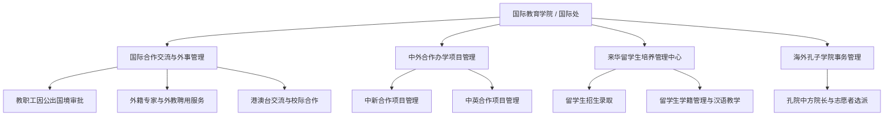

# 国际教育学院 机构设置与业务职能

- **机构名称**：湖南城市学院国际教育学院（国际合作与交流处）
- **版本号**：v1.0 (生效中)
- **更新日期**：2026-09-12
- **官方网址**：https://gjjyxy.hncu.edu.cn/xygk/bmjj.htm
- **合作院校**：新西兰维特利亚理工学院、英国西苏格兰大学、澳门科技大学等

---

## 🏢 涉外管理机构与合作办学架构

---

## 📌 核心管理业务与服务范围

1. **外事与出入境管理**：执行国家外事政策，负责学校国际化战略规划，办理全校公派出国访问学者、交换生遴选审批及因公出国护照签证；
2. **中外合作办学**：统筹管理教育部批准的中外合作办学项目，推进双学位、学分互认与国际本硕联合培养；
3. **来华留学教育**：负责全校外国留学生的招生宣传、资格审查、居留许可办理、中华优秀传统文化研修及日常教学运行；
4. **孔子学院建设**：负责海外共建孔子学院的理事会协调、师资与国际中文教育志愿者选派与日常教学运营。
