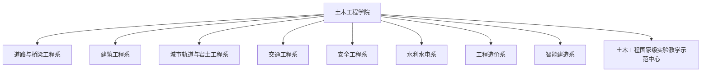

# 土木工程学院 机构设置与专任师资队伍

- **机构名称**：湖南城市学院土木工程学院
- **版本号**：v1.0 (生效中)
- **更新日期**：2026-09-12
- **官方网址**：http://tmgc.hncu.edu.cn/szdw/jzgcx.htm
- **学科特色**：国家级一流本科专业建设点、国家级实验教学示范中心、通过工程教育认证专业

---

## 🏢 教学基层系室架构

学院下设 **8个专业教学系**、**1个力学教研室** 及 **1个土木工程实验教学中心**：

---

## 👨‍🏫 专任教师名录（按系室分布）

### 📌 道路与桥梁工程系 (20人)

| 序号 | 教师姓名与职称学位 |
| :--- | :--- |
| 1 | 曹国辉 教授 博士 |
| 2 | 曾革主任 教授 博士 |
| 3 | 王新忠副处长 教授 博士 |
| 4 | 陈强 教授 在读博士 |
| 5 | 陈湘亮 副教授 博士 |
| 6 | 刘劲 教授 博士 |
| 7 | 李苗 副教授 博士 |
| 8 | 丁星妤 教授 博士 |
| 9 | 祝轩 讲师 博士 |
| 10 | 丁乐 讲师 博士 |
| 11 | 毛宇 高级工程师 博士 |
| 12 | 戈雅萍 讲师 博士 |
| 13 | 阳逸鸣 副教授 博士 |
| 14 | 冯浩雄 副教授 硕士 |
| 15 | 王灿辉 副教授 硕士 |
| 16 | 周雁群 讲师 博士 |
| 17 | 羊日华 副教授 博士 |
| 18 | 李海 副教授/高级工程师 博士 |
| 19 | 黄国平 副教授 在读博士 |
| 20 | 周术明 副教授 博士 |

### 📌 建筑工程系 (20人)

| 序号 | 教师姓名与职称学位 |
| :--- | :--- |
| 1 | 谭献良副校长 教授级高级工程师 博士 |
| 2 | 张再华 教授 博士 |
| 3 | 毛广湘 副教授 博士 |
| 4 | 余东 高级工程师  博士 |
| 5 | 刘益虹 副教授 硕士 |
| 6 | 王文君 博士 |
| 7 | 王玉奎 副教授 博士 |
| 8 | 贺冉 副教授 博士 |
| 9 | 方列兵 副教授 硕士 |
| 10 | 陈利群 副教授 硕士 |
| 11 | 孟茁超 副教授 硕士 |
| 12 | 彭朝晖 副教授 硕士 |
| 13 | 王建平 高级工程师 硕士 |
| 14 | 陈咏明  高级工程师 硕士 |
| 15 | 何栋梁 副教授 博士 |
| 16 | 唐荣华 高级工程师 硕士 |
| 17 | 李井超 讲师 博士 |
| 18 | 郭佳 讲师 博士 |
| 19 | 张丹 讲师 博士 |
| 20 | 蔡晶垚 讲师 在读博士 |

### 📌 城市轨道与岩土工程系 (18人)

| 序号 | 教师姓名与职称学位 |
| :--- | :--- |
| 1 | 陈宏伟 副教授 博士 |
| 2 | 邓宗伟 教授 博士 |
| 3 | 郭尤林 副教授 博士 |
| 4 | 洪亮 副教授 博士 |
| 5 | 徐赞 讲师 在读博士 |
| 6 | 张亮 副教授 博士 |
| 7 | 杨仙 副教授 博士 |
| 8 | 梁小强 副教授 博士 |
| 9 | 胡达 教授 博士 |
| 10 | 彭细荣 教授 博士 |
| 11 | 唐皇 教授 博士 |
| 12 | 郑良飞 高级工程师 博士 |
| 13 | 李星新 高级工程师 博士 |
| 14 | 周怡 高级工程师 博士 |
| 15 | 谭德喜 高级工程师 学士 |
| 16 | 高琼 讲师 博士 |
| 17 | 洪新民 讲师 博士 |
| 18 | 吴月星 讲师 博士 |

### 📌 交通工程系 (7人)

| 序号 | 教师姓名与职称学位 |
| :--- | :--- |
| 1 | 龙琼 教授 硕士 |
| 2 | 蔡建荣 副教授 博士 |
| 3 | 谢练 高级实验师 博士 |
| 4 | 喻杰 讲师 博士 |
| 5 | ​周昭明 讲师 在读博士 |
| 6 | 张谨帆 讲师 在读博士 |
| 7 | 张蕾 讲师 硕士 |

### 📌 安全工程系 (11人)

| 序号 | 教师姓名与职称学位 |
| :--- | :--- |
| 1 | 刘国军 讲师 博士 |
| 2 | 姚琦 副教授 博士 |
| 3 | 息朝庄 副教授 博士 |
| 4 | 吴宽 副教授 博士 |
| 5 | 王飞飞 工程师 博士 |
| 6 | 胡阿香 副教授 博士 |
| 7 | 任恒 讲师 博士 |
| 8 | 匡雅 讲师 博士 |
| 9 | 郭赞 讲师 博士 |
| 10 | 谭婉玉 讲师 博士 |
| 11 | 龚彬彬 讲师 在读博士 |

### 📌 水利水电系 (9人)

| 序号 | 教师姓名与职称学位 |
| :--- | :--- |
| 1 | 付贵海 教授 博士 |
| 2 | 王鑫 在读博士 |
| 3 | 黄永刚 讲师 博士 |
| 4 | 仇振杰 副教授 博士 |
| 5 | 李志平 高级工程师 博士 |
| 6 | 曹艳敏 副教授 博士 |
| 7 | 何叶 讲师  博士 |
| 8 | 符鲜 讲师 博士 |
| 9 | 李珊珊 讲师 博士 |

### 📌 工程造价系 (20人)

| 序号 | 教师姓名与职称学位 |
| :--- | :--- |
| 1 | 田雁新 副教授 硕士 |
| 2 | 莫连光 教授  博士 |
| 3 | 孟新田 教授 硕士 |
| 4 | 曾新发 副教授 博士 |
| 5 | 成彦惠 副教授 博士 |
| 6 | 何美丽 副教授 硕士 |
| 7 | 殷灿彬 副教授 在读博士 |
| 8 | 余方 副教授 在读博士 |
| 9 | 谭智萍 副教授 硕士 |
| 10 | 刘粤湘 副教授 硕士 |
| 11 | 王伟宏 副教授 硕士 |
| 12 | 晏永玲 高级工程师 硕士 |
| 13 | 邓超 讲师 博士 |
| 14 | 吴曦 讲师 博士 |
| 15 | 张艳 讲师 硕士 |
| 16 | 姜珉 讲师 硕士 |
| 17 | 陈婧 讲师 硕士 |
| 18 | 张拓 讲师 硕士 |
| 19 | 罗燕玲 讲师 硕士 |
| 20 | 魏启智 讲师 硕士 |

### 📌 智能建造系 (10人)

| 序号 | 教师姓名与职称学位 |
| :--- | :--- |
| 1 | 周炜 副教授 博士 |
| 2 | 张根宝 副教授 博士 |
| 3 | 张再华 教授 博士 |
| 4 | 贺冉 副教授 博士 |
| 5 | 龙昊 讲师 博士 |
| 6 | 唐葭 副教授 硕士 |
| 7 | 王继新 讲师 博士 |
| 8 | 谢金 讲师 在读博士 |
| 9 | 尹泉 讲师 博士 |
| 10 | 黄佳星 博士 |

---

## 🔬 实验教学与科研创新平台

1. **国家级平台**：土木工程国家级实验教学示范中心（湖南城市学院）
2. **省级科研平台**：城市地下基础设施结构安全与防灾湖南省工程研究中心
3. **专业教研室**：结构工程教研室、道路工程教研室、岩土工程教研室、力学教研室
