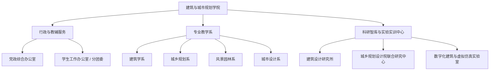

# 建筑与城市规划学院 机构设置与专任师资队伍

- **机构名称**：湖南城市学院建筑与城市规划学院
- **版本号**：v1.0 (生效中)
- **更新日期**：2026-09-12
- **官方网址**：http://jzgh.hncu.edu.cn/
- **特色专业**：建筑学、城乡规划、风景园林、城市设计（国家级/省级一流专业建设点）

---

## 🏢 学院内设基层教学与行政机构

学院设有 **4个教学专业系** 与 **2个行政教辅服务机构**：

---

## 👨‍🏫 专任教师名录与学者梯队

学院现有专任教师队伍中拥有一批省内外知名学者、教授级高工、注册规划师及青年博士骨干：

### 1. 领军学者与资深教授/正高级工程师
- **汤放华** 教授（原校长、博士生导师、学科带头人）
- **吕贤军** 教授级高级工程师
- **曾志伟** 教授
- **宁启蒙** 教授 / 博士（院长）
- **易纯** 教授 / 博士（副院长、高级规划师）
- **李志学** 正高级工程师
- **石孟良** 教授
- **余红兵** 教授
- **周小梅** 教授
- **刘敏** 教授
- **谭淑端** 教授
- **易家骏** 正高级工程师
- **熊惠华** 教授

### 2. 副教授 / 高级工程师中坚骨干
- **彭建国** 副教授（党委书记）
- **汤慧** 副教授 / 博士（副院长、注册规划师）
- **王晓华** 副教授
- **陈一溥** 副教授
- **曾磬** 副教授
- **文彤** 副教授
- **陈宇** 高级工程师
- **李小舟** 高级工程师
- **徐云辉** 副教授
- **周拥军** 副教授
- **李莺** 副教授
- **唐正君** 高级工程师
- **蒋刚** 高级工程师
- **谢志平** 高级工程师
- **雷文韬** 副教授
- **龙运涛** 高级工程师
- **龙天翔** 副教授
- **杨楠** 副教授
- **古杰** 副教授
- **廖建平** 副教授
- **郑贱成** 高级工程师
- **谢宏坤** 副教授

### 3. 青年骨干教师与博士群体
- **博士教师**：刘彬、龚皓锋、高盛（在读）、张梁（在读）、姜纪水、祝宪章、刘沅、王何王、肖克梅、朱琳、莫文波、陈笑葵（在读）、科米、罗巧、吕采怡（在读）、杨剑（在读）
- **专任教师**：彭芳、李真、张弘、陈亮、韩晓娟、钟丹、马平、周波、李佳伶、崔红萍、方程、黄琛、刘培芳、董武娟、王道静、朱莎莎、鲁波、欧阳慧婷、唐璇、喻思雅、陈匀杉、黄政容、尚玉涛、李欣尧、彭文韬、陈曼芳、钟玥
