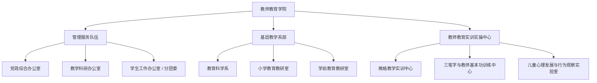

# 教师教育学院 机构设置与专任师资队伍

- **机构名称**：湖南城市学院教师教育学院
- **版本号**：v1.0 (生效中)
- **更新日期**：2026-09-12
- **官方网址**：https://jsjyxy.hncu.edu.cn/szdw.htm
- **核心专业**：小学教育（国家一流/师范认证专业）、学前教育

---

## 🏢 基层教学系室与管理机构设置

---

## 👨‍🏫 核心专任教师与师范导师队伍

全院建有一支长期扎根基础教育教学研究的专业师资队伍：
- **教育科学系专任教师**：承担教育学原理、教育心理学、教育统计与测量、课程与教学论等专业核心课程教学。
- **小学教育教研室**：承担小学语文教学法、小学数学教学法、班主任工作艺术及小学全科教育实践指导。
- **特聘名师与导师队伍**：联合省内多所重点示范性小学、幼儿园一线特级教师及省级学科带头人，构建“双导师”育人机制。
