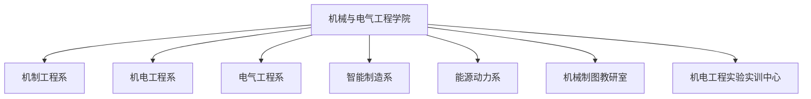

# 机械与电气工程学院 机构设置与专任师资队伍

- **机构名称**：湖南城市学院机械与电气工程学院
- **版本号**：v1.0 (生效中)
- **更新日期**：2026-09-12
- **官方网址**：http://www.hncu.edu.cn/jxydqgcxy/xyjj/szdw.htm
- **本科专业**：机械设计制造及其自动化、电气工程及其自动化、智能制造工程、能源与动力工程
- **硕士授权点**：能源动力专业硕士学位点

---

## 🏢 教学基层组织架构

学院下设 **5个教学系**、**1个制图教研室** 及 **1个实验实训中心**：

---

## 👨‍🏫 专任教师队伍名录（按系室公布）

全院现有专任教师 **70人**，高级职称 **30人**、博士 **35人**。

### 1. 机制工程系
| 姓名 | 职称 | 学位 | 毕业院校 | 专业领域 |
| :--- | :--- | :--- | :--- | :--- |
| **丁小兵** | 高级讲师 | 学士 | 武汉纺织大学 | 机械工程 |
| **范彬** | 副教授 | 硕士 | 江苏科技大学 | 船舶与海洋工程 |
| **刘玉振** | 副教授 | 博士 | 中南大学 | 机械工程 |
| **殷赳** | 副教授 | 博士 | 湖南大学 | 机械工程 |
| **尹旭妮** | 讲师 | 博士 | 湖南大学 | 机械工程 |
| **胡杰** | 讲师 | 博士 | 青岛大学 | 材料科学与工程 |
| **熊志宏** | 讲师 | 博士 | 中南大学 | 机械工程 |
| **刘兰** | 工程师 | 硕士 | 长沙理工大学 | 交通运输工程 |
| **曾琦** | 讲师 | 硕士 | 中南大学 | 机械工程 |
| **陈骏霆** | 讲师 | 硕士 | 中南大学 | 机械工程 |

### 2. 机电工程系、电气工程系与智能制造系骨干学者
- **张光富** 教授 / 博士（中南大学物理学博士、院长、国家自然科学基金主持者）
- **黄志亮** 教授 / 博士
- **周建存** 教授 / 博士（党委书记）
- 另有一批从事智能制造工程、电气自动化、能源动力系统仿真的青年博士与双师双能型骨干教师。
