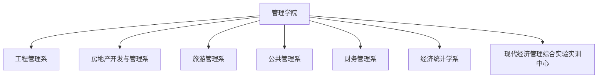

# 管理学院 机构设置与专任师资队伍

- **机构名称**：湖南城市学院管理学院
- **版本号**：v1.0 (生效中)
- **更新日期**：2026-09-12
- **官方网址**：http://www.hncu.edu.cn/xglxy/
- **学科专业**：工程管理（国家一流专业）、工程造价、房地产开发与管理、财务管理、旅游管理、公共事业管理、经济统计学

---

## 🏢 学院基层教学系室组织架构

---

## 👨‍🏫 6大专业系专任师资名录

### 📌 工程管理系 (10人)

| 序号 | 教师姓名、职称与岗位职务 |
| :--- | :--- |
| 1 | 联系方式 |
| 2 | 汤勇 院长、博士、教授 |
| 3 | 刘正夫 系主任、博士、讲师 |
| 4 | 彭懿 系副主任、博士、讲师 |
| 5 | 王正安 高级工程师 |
| 6 | 龙敬庭  副教授 |
| 7 | 高武  博士、教授 |
| 8 | 高向华  博士、副教授 |
| 9 | 张胜 博士、副教授 |
| 10 | 陈艳  博士、副教授 |

### 📌 房地产开发与管理系 (7人)

| 序号 | 教师姓名、职称与岗位职务 |
| :--- | :--- |
| 1 | 联系方式 |
| 2 | 钱骅 系主任、博士、高级工程师 |
| 3 | 郑慧开 博士、教授 |
| 4 | 徐敏珍 博士、讲师 |
| 5 | 张世平 讲师 |
| 6 | 李军 讲师 |
| 7 | 刘宜松 讲师 |

### 📌 旅游管理系 (6人)

| 序号 | 教师姓名、职称与岗位职务 |
| :--- | :--- |
| 1 | 联系方式 |
| 2 | 刘文斌 党支部书记 副教授 |
| 3 | 尹罡 系主任、副教授 |
| 4 | 昌晶亮 副教授 |
| 5 | 陈海波 副教授 |
| 6 | 刘婷 讲师 |

### 📌 公共管理系 (10人)

| 序号 | 教师姓名、职称与岗位职务 |
| :--- | :--- |
| 1 | 联系方式 |
| 2 | 刘刚 副院长、博士、副教授 |
| 3 | 郭韵奇 系主任、博士、讲师 |
| 4 | 盛虎宜 教授级高工 |
| 5 | 陈宋绯 副教授 |
| 6 | 刘勇波 副教授 |
| 7 | 汤资岚 博士、讲师 |
| 8 | 龙慧峰 讲师 |
| 9 | 董成 讲师 |
| 10 | 王荷英 讲师 |

### 📌 财务管理系 (10人)

| 序号 | 教师姓名、职称与岗位职务 |
| :--- | :--- |
| 1 | 联系方式 |
| 2 | 周琼 党委委员、系主任、讲师 |
| 3 | 周慧 副教授 |
| 4 | 谢华 副教授 |
| 5 | 冯志艳 讲师 |
| 6 | 李娴娟 讲师 |
| 7 | 陈芳 讲师 |
| 8 | 陈佳 讲师 |
| 9 | 周元圆 讲师 |
| 10 | 汪荟荃 助教 |

### 📌 经济统计学系 (7人)

| 序号 | 教师姓名、职称与岗位职务 |
| :--- | :--- |
| 1 | 联系方式 |
| 2 | 封彦 系主任、讲师 |
| 3 | 王梦贤 博士、副教授 |
| 4 | 胡帅 博士、讲师 |
| 5 | 蒋丽萍 博士、讲师 |
| 6 | 刘嵩 讲师 |
| 7 | 曾靖 讲师 |

---

## 🔬 科研基地与智库平台

1. **湖南省城市经济研究基地**（省级社科重点研究基地，执行主任：汤勇 教授）
2. **湖南城市学院城乡协调发展研究中心**
