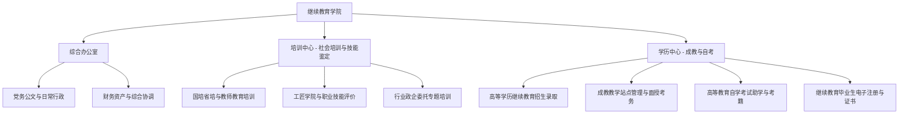

# 继续教育学院 机构设置与科室职责

- **机构名称**：湖南城市学院继续教育学院
- **版本号**：v1.0 (生效中)
- **更新日期**：2026-09-12
- **官方网址**：http://jxjy.hncu.edu.cn/xygk/jgsz.htm
- **办学模式**：高等学历继续教育（函授/业余）、高等教育自学考试（自考助学）、非学历社会培训、职业技能等级评价

---

## 🏢 内设三大管理中心架构与职责划分

---

## 📌 三大核心中心具体业务职责

### 1. 综合办公室（电话：0737-4629020）
- 负责学院日常行政公文收发、会议纪要编制、公章管理与档案归档；
- 负责学院教职工考勤、绩效考核初审、办公耗材申报采购与后勤保障；
- 负责学院网站信息维护、对外联络接待及校友事务对接。

### 2. 培训中心（电话：0737-4629199）
- 负责全省中小学教师“国培计划”、“省培计划”等师资培训项目的竞标、实施与管理；
- 负责益阳市工匠学院建设、面向社会开展职业技能等级认定与岗位技能培训；
- 负责各级政企事业单位、行业协会委托的各类非学历高端研修班的组织实施。

### 3. 学历中心（电话：0737-4628115）
- 负责制定高等学历继续教育招生简章，组织开展成考招生宣传与考生录取审核；
- 负责校外教学点（函授站）的资质审核、巡查评估与教学指导；
- 负责成教学历教育开课排课、线上平台选课监控、期末统考命题组考与成绩录入；
- 负责高等教育自学考试专升本助学、免考课程审核、自考实践考核与毕业答辩；
- 负责成人高等教育毕业证书电子注册、学士学位外语水平考试与学士学位审核申报。
