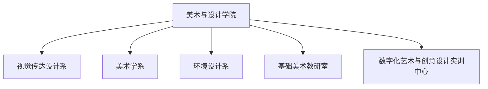

# 美术与设计学院 机构设置与专任师资队伍

- **机构名称**：湖南城市学院美术与设计学院
- **版本号**：v1.0 (生效中)
- **更新日期**：2026-09-12
- **官方网址**：http://myxy.hncu.edu.cn/szdw.htm
- **特色专业**：环境设计（国家级一流本科专业）、视觉传达设计、美术学（师范认证）

---

## 🏢 学院基层教学系室架构

---

## 👨‍🏫 核心系室负责人与专任教师名录

### 📌 1. 视觉传达设计系
- **系主任**：**刘一颖**（博士、讲师）
- **党支部书记**：**杨艾云**（讲师）
- **系副主任**：**李澍**（讲师）
- **骨干专任教师**：**龙湘平**（教授）、**钟正武**（副教授）、**郑学达**（讲师）等

### 📌 2. 美术学系（师范专业认证）
- **系主任**：**李西洋**（副教授）
- **党支部书记**：**袁志准**（博士、副教授）
- **系副主任**：**肖炽热**（副教授）
- **骨干专任教师**：**谷利民**（教授、院长）、**陈升起**（副教授）、**王海**（讲师）等

### 📌 3. 环境设计系（国家级一流专业建设点）
- **系主任**：**刘铁生**（副教授）
- **党支部书记**：**杨勇**（博士、讲师）
- **系副主任**：**刘明辉**（博士、副教授）
- **骨干专任教师**：**龚力**（副教授、副院长）、**刘玉寒**（讲师）、**欧阳**（讲师）等

### 📌 4. 资深名师与教授风采
- **龙湘平** 教授（资深艺术设计带头人）
- **谷利民** 教授（中国美术家协会会员、油画艺术家、院长）
- **段知力** 副教授 / 博士
- **刘高瞻** 副教授
- **袁志准** 副教授 / 博士
