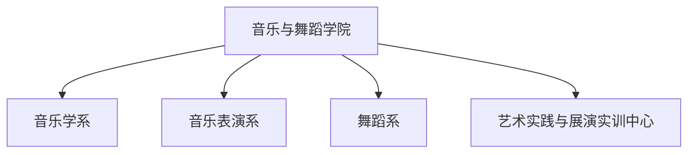

# 音乐与舞蹈学院 机构设置与专任师资队伍

- **机构名称**：湖南城市学院音乐与舞蹈学院
- **版本号**：v1.0 (生效中)
- **更新日期**：2026-09-12
- **官方网址**：http://yywd.hncu.edu.cn/szdw/ylxx.htm
- **本科专业**：音乐学（师范类）、音乐表演、舞蹈编导

---

## 🏢 基层教学系室组织架构

---

## 👨‍🏫 教学系室负责人与专任教师名录

### 📌 1. 音乐学系（师范专业认证）
- **骨干教授/院长**：**曹蕙姿**（教授、博士，湖南省青年骨干教师）
- **系主任**：**刘科**（副教授）
- **党支部书记**：**周晋**（博士后、讲师）

### 📌 2. 舞蹈系
- **系主任**：**任慧婷**（副院长、副教授、博士）
- **党支部书记**：**李芬**（博士、讲师）
- **专任教师**：**宋和明**（副教授、在读博士）、**彭琳茜**（博士、讲师）等

### 📌 3. 名师风采与客座教授专家
- **周勇** 教授（资深音乐理论与教学专家）
- **朱咏北** 教授（“会龙学者”讲座教授、著名音乐教育家）
- **居其宏** 教授（特聘客座教授、著名音乐学家）
- **石叔诚** 教授（特聘客座教授、著名钢琴家、指挥家、《黄河》钢琴协奏曲主要创作者与首演者）
