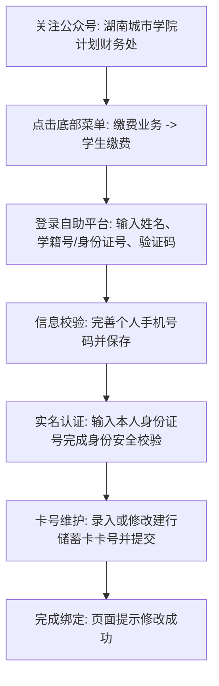

# 湖南城市学院学生银行卡号信息完善与绑定操作指南 (财务处版)

> **发布管理单位**：湖南城市学院计划财务处  
> **服务业务范畴**：国家奖学金、国家励志奖学金、校级奖学金、国家助学金、勤工助学酬金、各类竞赛奖励及学杂费退费转账发放  
> **核心办理平台**：“湖南城市学院计划财务处”官方微信公众号 $\rightarrow$ 网络自助缴费平台  
> **限定承办银行**：**中国建设银行（CCB）借记卡 / 储蓄卡**（仅支持本人名下建行卡，不支持其他银行或信用卡）  

---

## ⚠️ 重要前置须知

1. **唯一受托银行**：学校财务系统与中国建设银行完成专线联网，**各项资金发放仅支持汇入中国建设银行储蓄卡**；
2. **实名开户一致性**：所填银行卡的开户人姓名、身份证号必须与学籍系统中的学生本人档案完全一致，严禁使用家长、亲友或其他代持人卡号；
3. **实体卡要求**：学生需在收到学校统一寄发的建行实体卡，或自行前往建行网点开卡并激活金融功能后，方可按本指南录入绑定。

---

## 📱 线上绑定与修改卡号七步操作流程

### 第一步：关注官方微信公众号
打开微信，搜索并关注“**湖南城市学院计划财务处**”官方微信公众号。

### 第二步：进入学生缴费业务
进入公众号主页，点击底部菜单栏中的【**缴费业务**】 $\rightarrow$ 选择【**学生缴费**】。

### 第三步：登录网络自助缴费平台
在“网络自助缴费平台 - 缴费查询”登录页面，依次填写：
- **姓名**：学生本人真实姓名
- **学籍号**：填入学籍号或本人 18 位身份证号码
- **验证码**：输入右侧图形验证码  
点击【**查询**】按钮进入系统。

### 第四步：核对个人信息并更新联系方式
登录成功后进入个人主页，核对姓名、学号、所属学院及专业班级无误后：
1. 点击【**手机**】字段录入当前使用的手机号码；
2. 点击【**资料修改**】保存手机号。

### 第五步：身份安全二要素核验
为保护学生账户与财产安全，系统要求在修改核心财务资料前进行实名身份校验：
- 在“身份信息检验”页面，完整输入**本人 18 位身份证号码**；
- 点击【**开始检验**】；检验通过后即可解锁银行卡号编辑权限。*(注：若检验失败系统将直接退出，请仔细核对身份证号)*

### 第六步：录入或变更银行卡号
1. 校验通过后进入“个人资料修改”页面；
2. 在【**银行账号**】输入框内，准确输入**本人中国建设银行 19 位储蓄卡卡号**；
3. 仔细核对卡号每一位数字，防止输错导致款项打款失败。

### 第七步：提交确认与生效
点击【**确定**】提交。页面弹出提示【**修改成功**】，即代表银行卡信息已正式与校内财务系统绑定并即刻生效。

---

## 🔄 银行卡遗失、补办或换卡处理指引

若因银行卡丢失、损坏或消磁导致补办新卡：
1. **就近补卡**：持本人身份证前往就近的中国建设银行网点挂失并补办新的建行储蓄卡；
2. **及时更新录入**：收到新卡后，必须**在当月发款日前**按照上述七步流程重新登录财务处平台，将系统内旧卡号更新替换为新卡号；
3. **避免发款异常**：若未及时更新，银行系统因卡号注销而原路退票，将延误当期奖助学金的正常到账。
